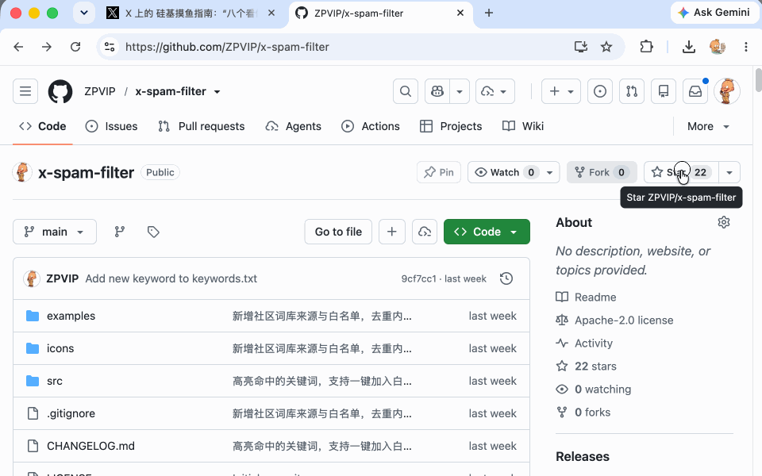
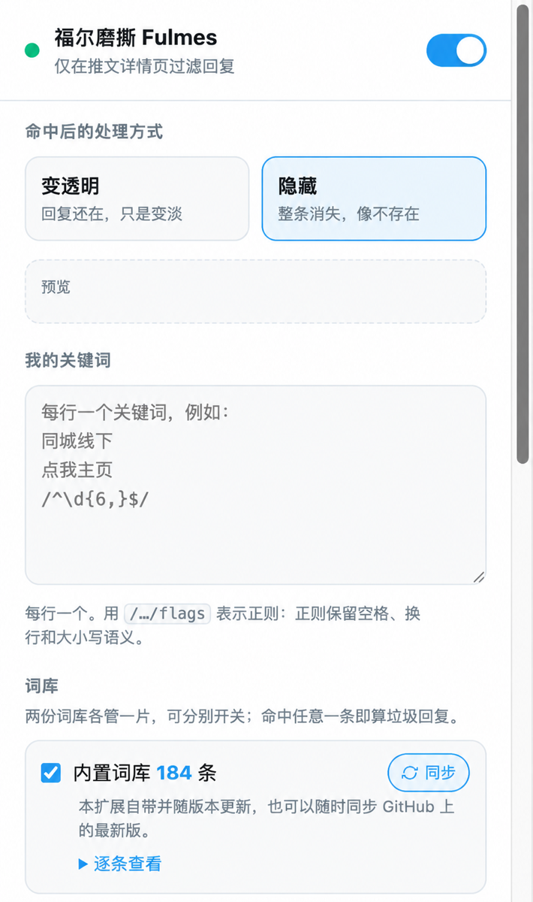
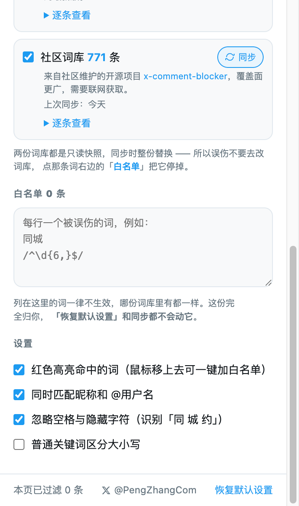

  

<h1 align="center">福尔磨撕 Fulmes</h1>

  English | <a href="README-CN.md">中文</a>

  <strong>Filter spam replies below posts on X by keyword.</strong> 
  Fulmes changes only what you see in your browser. Matching replies can appear dimmed or remain hidden.

  
  
  
  

  <a href="https://chromewebstore.google.com/detail/fulmes/gpfkmempinhlopfkomklkkbdeggaknmo">Install from the Chrome Web Store</a>
  |
  <a href="#what-fulmes-does">How it works</a>
  |
  <a href="#mobile-installation">Mobile installation</a>
  |
  <a href="#settings">Settings</a>
  |
  <a href="#permissions-and-network-access">Permissions</a>
  |
  <a href="CHANGELOG.md">Changelog</a>
  |
  <a href="privacy-policy.md">Privacy policy</a>

## What Fulmes does

Fulmes works on desktop and mobile through supported browsers. Desktop support includes Chromium-based browsers such as Chrome, Edge, and Brave. Mobile support includes Yandex Browser on Android and Orion on iPhone and iPad. See the installation sections below for compatibility details.

Fulmes processes replies on post detail pages that you open on X. It reads the text, display name, and username already rendered in the page, compares that text with local keyword rules, and marks matching reply elements for dimming or hiding. It never filters the main post. Disabling the extension restores the page immediately.

Fulmes does not automate any action on X. It does not post, reply, like, repost, follow, unfollow, block, mute, report, hide a reply through X, or modify account data. It does not read cookies or authentication tokens, call the X API or internal GraphQL endpoints, or make extra network requests to X.

Fulmes does not collect, store, or transmit post content or account information. The extension changes only the local presentation of content that X has already rendered in the user's browser. Fulmes is an independent project and is not affiliated with or endorsed by X Corp.

These boundaries distinguish Fulmes from automated posting, bulk engagement, automated blocking, and browser bots. Fulmes does not perform the account automation actions described in the [X Automation Rules](https://help.x.com/en/rules-and-policies/x-automation).

## Installation

[Install Fulmes from the Chrome Web Store](https://chromewebstore.google.com/detail/fulmes/gpfkmempinhlopfkomklkkbdeggaknmo).

The extension supports Chromium-based browsers such as Chrome, Edge, and Brave. The default keyword lists and settings work without configuration. Click the extension icon to change the filtering mode or keyword rules.

## Mobile installation

Chrome and Safari on mobile devices cannot install this extension directly from the Chrome Web Store. On Android, Yandex Browser can install Chrome extensions. On iPhone and iPad, Orion offers beta support for Chrome extensions. Fulmes works on <code>x.com</code> in the browser, not in the native X app.

### Android with Yandex Browser

Yandex Browser requires Android 9.0 or later for Chrome extensions. See the [official Yandex Browser extension guide](https://yandex.com/support/browser-mobile-android-phone/en/personal-settings/extensions).

1. Install [Yandex Browser](https://play.google.com/store/apps/details?id=com.yandex.browser).
2. Open the [Fulmes Chrome Web Store page](https://chromewebstore.google.com/detail/fulmes/gpfkmempinhlopfkomklkkbdeggaknmo) in Yandex Browser.
3. Select **Add to Chrome**, then confirm with **Add extension**.
4. Open <code>https://x.com/</code> and visit a post detail page.
5. To change settings, open **Extensions** in the Yandex Browser menu and select **Fulmes**.

If the store page has no installation button, open **Extensions**, select **More extensions**, and open the Fulmes store page again.

### iPhone and iPad with Orion

Orion's support for Chrome extensions on iOS and iPadOS is in beta. Some Chrome extension APIs may not work. See the [official Orion extension guide](https://help.kagi.com/orion/browser-extensions/ios-ipados-extensions.html).

1. Install [Orion Browser by Kagi](https://apps.apple.com/app/orion-browser-by-kagi/id1484498200).
2. Open Orion settings and enable Chrome extension support under **Extensions**.
3. Open the [Fulmes Chrome Web Store page](https://chromewebstore.google.com/detail/fulmes/gpfkmempinhlopfkomklkkbdeggaknmo) in Orion.
4. Select the installation button and confirm the installation.
5. Open <code>https://x.com/</code> and visit a post detail page.
6. To change settings, open **Extensions** in the Orion menu and select **Fulmes**.

Desktop Chrome and Yandex Browser on Android provide more reliable compatibility than Orion because Orion does not support every Chrome extension API.

## Demo

The demo shows installation, reply filtering, mode switching, and opacity adjustment.

## Filtering modes

### Dim

Matching replies stay in place at reduced opacity. You can adjust the opacity from 0% to 100%. At 100%, Fulmes also disables pointer interaction to prevent accidental clicks.

### Hide

Matching replies use <code>display: none</code> and disappear from the local page.

## Features

- Fulmes filters only replies on post detail pages. It never filters the main post.
- A <code>MutationObserver</code> processes replies as X adds or changes them. Fulmes does not poll the reply DOM or repeatedly scan an unchanged page.
- Built-in and community keyword lists have separate controls and update actions.
- Custom rules support plain keywords and JavaScript regular expressions in <code>/pattern/flags</code> form.
- A whitelist disables individual rules without editing synchronized keyword lists.
- Optional highlighting shows which rule matched the text, display name, or username. You can add the highlighted rule to the whitelist from the page.
- Matching can ignore spaces, zero-width characters, and direction-control characters used to split words.
- The extension badge shows the number of filtered replies on the current page.
- All settings and downloaded keyword lists stay in <code>chrome.storage.local</code>.

## Comparison with X muted words

X has a built-in muted-words feature. Fulmes addresses a different workflow: it loads maintained keyword lists in bulk, supports regular expressions, explains each match, and lets you dim a reply instead of removing it from view.

| Capability | X muted words | Fulmes |
| --- | --- | --- |
| Add rules | Enter one rule at a time | Start with maintained keyword lists |
| Updates | Manual | Manual one-click synchronization |
| Regular expressions | Not supported | Supported |
| Split words and zero-width characters | May not match | Normalized before matching |
| False positive handling | Find and remove the muted word | Add the matching rule to the whitelist |
| Display after a match | Hidden by X | Dimmed or hidden locally |
| Storage | X account setting | Local extension storage |
| Scope | Multiple X surfaces | Replies on post detail pages |

You can use both features at the same time.

## Why Fulmes does not block accounts

Blocking an account changes persistent account state and requires an authenticated action on X. Automating that action would require access to account credentials or internal endpoints and could trigger account enforcement.

Fulmes deliberately avoids that design. A local keyword rule can cover many existing and future spam accounts without changing the user's X account. If you want to block a specific account, use the control provided by X.

## Settings

Click the Fulmes extension icon to open the settings panel.

| 1 | 2 |
| --- | --- |
|  |  |

| Setting | Behavior |
| --- | --- |
| Enabled | Restores all replies when disabled |
| Dim or hide | Selects the display treatment for matching replies |
| Opacity | Controls dim mode from 0% to 100% |
| My keywords | Accepts one plain keyword or regular expression per line |
| Built-in keywords | Enables the keyword list packaged with Fulmes |
| Community keywords | Enables the list maintained by x-comment-blocker |
| Sync | Downloads and validates the latest selected <code>keywords.txt</code> file |
| Whitelist | Disables matching rules without changing the source lists |
| Highlight matches | Marks matching text and adds an in-page whitelist control in dim mode |
| Match names | Includes display names and usernames |
| Ignore spaces and hidden characters | Detects split words and common invisible characters |
| Case-sensitive plain keywords | Changes plain-keyword matching only. Regular expression flags remain authoritative |

Changes take effect without reloading the page.

### Keyword sources

| List | Maintainer | Editing | Source | Reset behavior |
| --- | --- | --- | --- | --- |
| Built-in keywords | Fulmes | Read-only snapshot | Packaged <code>keywords.txt</code>, with updates from [ZPVIP/Fulmes](https://github.com/ZPVIP/Fulmes) | Restores the packaged list |
| Community keywords | Community | Read-only snapshot | [amahteru/x-comment-blocker](https://github.com/amahteru/x-comment-blocker) | Clears the snapshot and downloads it again |
| My keywords | User | Editable | Local input | Preserved |
| Whitelist | User | Editable | Local input or the in-page control | Preserved |

Synchronization replaces only the selected read-only snapshot. Fulmes rejects empty files, files larger than 2 MB, and HTML error pages. If synchronization fails, Fulmes keeps the previous local snapshot.

### Regular expressions

Wrap a JavaScript regular expression in slashes and add optional flags:

    /^\d{6,}$/
    /(telegram|whatsapp)\s*:/
    /t\.me\//

Fulmes removes the stateful <code>g</code> and <code>y</code> flags to prevent inconsistent results from <code>RegExp.lastIndex</code>. Invalid expressions are ignored and reported in the browser console.

## Install from source

1. Clone or download this repository.
2. Open <code>chrome://extensions/</code> in Chrome.
3. Enable **Developer mode**.
4. Select **Load unpacked** and choose the <code>Fulmes/</code> directory.

Edit the root <code>keywords.txt</code> file to change the packaged keyword list, then reload the extension. A source installation and a Chrome Web Store installation use different extension IDs and separate settings. Keep only one enabled to avoid processing the same page twice.

## Implementation

Fulmes keeps reply filtering incremental:

1. A <code>MutationObserver</code> queues only added or changed reply elements. <code>requestAnimationFrame</code> batches visible work, with a 300 ms timer fallback for background tabs.
2. Plain keywords are compiled into regular-expression chunks of up to 400 rules. Custom regular expressions are compiled once and reused.
3. A <code>WeakMap</code> caches each reply's content signature and result. Removed DOM elements do not remain referenced by the cache.
4. One attribute and one CSS variable on the root element control display mode and opacity. Mode changes do not rescan the page.
5. The Navigation API detects committed SPA route changes without replacing <code>history.pushState</code> or <code>history.replaceState</code>. A low-frequency URL comparison supports browsers without that API.

## Permissions and network access

Fulmes requests the <code>storage</code> permission to save settings and keyword snapshots. Its only host permission is <code>https://raw.githubusercontent.com/*</code>, which it uses to download the two public keyword lists.

The extension does not request <code>tabs</code>, <code>cookies</code>, <code>webRequest</code>, or access to X endpoints. It does not make extra network requests to X. The X page continues to make its own normal requests.

See the [privacy policy](privacy-policy.md) for the data-handling statement.

## Project structure

    manifest.json
    CHANGELOG.md
    README.md
    README-CN.md
    privacy-policy.md
    keywords.txt
    src/
      shared.js
      content.js
      content.css
      background.js
      popup.html
      popup.css
      popup.js
    icons/
    examples/
